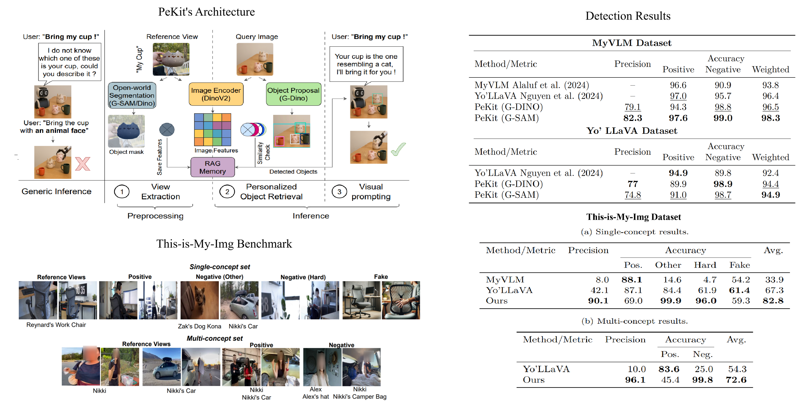

📄 Paper Link: https://arxiv.org/abs/2502.02452

# 📌 Personalization Toolkit (PeKit)



## 📑 Sections
- 📁 📖 Overview  
- 🧠 Method Summary  
- 📂 Dataset: This-is-My-Img  
- ⚙️ Installation  
- 🚀 Evaluation
- 📌 TODOs  
- 📚 Citation  

---

## 📖 Overview

**Personalization Toolkit (PeKit)** is a *training-free* approach for personalization of Large Vision-Language Models (LVLMs).  
Instead of fine-tuning or test-time training for each new concept, it uses:

- Pre-trained vision foundation models to extract distinctive features  
- Retrieval-Augmented Generation (RAG) to identify instances in visual inputs  
- Visual prompting to guide LVLM outputs efficiently  

This toolkit is model-agnostic, supports **multi-concept personalization**, and works on both **images and videos**.

## 🧠 Method Summary

### ✅ Key Components

1. **Training-Free View Extraction**  
   Extract object-level embeddings from reference images using pre-trained vision models (e.g., DINOv2, SAM).

2. **Personalized Object Retrieval**  
   Use a retrieval module over stored features to detect personalized concepts in query images.

3. **Personalized Answer Generation**  
   Generate tailored responses via LVLMs by overlaying visual prompts highlighting detected objects.

---

## 📂 Dataset: This-is-My-Img

Download the Dataset: [Google Drive Link](https://drive.google.com/drive/folders/1r13Si4PLlEXnCHQlwUMJEyHpFyQYgSrj?usp=sharing)

### Structure

```text
This-is-My-Img/
├── Single-concept/
│   ├── train/
│   │   └── [14 concepts]/
│   ├── test/
│   │   ├── Positive/
│   │   ├── Negative (Hard)/
│   │   ├── Negative (Other)/
│   │   └── Fake/
│   └── this-is-my-visual-qa-ambiguity.json
├── Multi-concept/
│   ├── train/
│   │   └── [21 concepts]/
│   ├── test/
│   │   └── [11 concept pairs]/
│   └── VQA/
│       └── [VQA files for each multi-concept pair]
```

---

## ⚙️ Installation

Clone the repository and set up the conda environment:

```bash
git clone https://github.com/vdorovatas/personalization_toolkit.git
cd personalization_toolkit
conda env create -f pekit.yaml
conda activate pekit
```

---

## 🚀 Evaluation

### Dataset Folder Structure

Download the datasets and organize them with the following structure:
```
myvlm/
└── data/
    └── [29 concepts]/

YoLLaVA/
├── train/
│   └── [40 concepts]/
└── test/
    └── [40 concepts]/

This-is-My-Img/
├── Single-concept/
│   ├── train/
│   │   └── [14 concepts]/
│   ├── test/
│   │   └── [14 concepts]/
│   └── this-is-my-visual-qa-ambiguity.json
│
└── Multi-concept/
    ├── train/
    │   └── [21 concepts]/
    ├── test/
    │   └── [11 concept pairs]/
    └── VQA/
        └── [VQA files for each multi-concept pair]
```
## Reference View Extraction

Extract reference view features from your dataset using the following command:
```bash
python extraction.py \
  --data_folder ./datasets/ \
  --dataset myvlm \
  --split train \
  --device_ids 0,1,2,3 \
  --n_training_views 5 \
  --variation augment \
  --n_augment 9 \
  --grounding_sam \
  --features_folder ./features/
```

### Arguments

| Argument | Type | Choices | Description |
|----------|------|---------|-------------|
| `--data_folder` | `str` | - | Path to your dataset directory |
| `--dataset` | `str` | `myvlm`, `yollava`, `this-is-my` | Dataset to process |
| `--split` | `str` | `train`, `test` | Data split (must be `train` for reference view extraction) |
| `--variation` | `str` | `normal`, `augment` | Feature extraction mode |
| `--n_augment` | `int` | - | Number of augmented views (only for `variation=augment`) |
| `--grounding_sam` | `flag` | - | Use Grounding SAM for mask extraction (omit to use Grounding DINO) |
| `--multi_concept` | `flag` | - | Process extended concepts (only for `this-is-my` dataset) |
| `--n_training_views` | `int` | - | Number of reference views to extract per concept |
| `--features_folder` | `str` | - | Directory to save extracted feature files |
| `--device_ids` | `str` | - | Comma-separated GPU device IDs (e.g., `0,1,2,3`) |

### Variation Modes

- **`normal`**: Extracts features only from the original reference views
- **`augment`**: Extracts features from both original and augmented reference views

### Example Usage

**Basic extraction with original views only:**
```bash
python extraction.py \
  --data_folder ./datasets/ \
  --dataset yollava \
  --split train \
  --variation normal \
  --n_training_views 3 \
  --features_folder ./features/
```

**Extraction with data augmentation:**
```bash
python extraction.py \
  --data_folder ./datasets/ \
  --dataset this-is-my \
  --split train \
  --variation augment \
  --n_augment 5 \
  --multi_concept \
  --features_folder ./features/
```
## Task 1: Object Detection Evaluation

Evaluate personalized object detection on your dataset:

```bash
python detection.py \
  --dataset yollava \
  --split test \
  --task detection \
  --n_training_views 1 \
  --data_folder ./datasets/ \
  --features_folder ./features/ \
  --grounding_sam \
  --detect_thresh 0.75
```

### Key Arguments

| Argument | Options/Type | Description |
|----------|--------------|-------------|
| `--dataset` | `myvlm`, `yollava`, `this-is-my` | Dataset to evaluate |
| `--split` | `train`, `test`, `validation` | Data split to process |
| `--task` | `detection` | Task type |
| `--n_training_views` | integer | Number of reference feature files to load per concept |
| `--data_folder` | path | Root directory containing dataset images |
| `--features_folder` | path | Directory containing pre-extracted features |
| `--grounding_sam` | flag | Load features from `gsam/` subdirectory (for features extracted with Grounding-SAM) |
| `--multi_concept` | flag | Enable multi-concept evaluation mode. Only for `this-is-my` dataset |
| `--test_split` | `Positive`, `Fake`, `Negative (Hard)`, `Negative (Other)` | For `this-is-my` dataset only - which split to evaluate |
| `--variation` | string | Feature variation type (default: `normal`) |
| `--detect_thresh` | float | Detection threshold (default: 0.75) |

### Output

Results are saved to `results/` directory as `.npy` files containing precision and recall metrics.

## Task 2: Visual Question Answering (VQA) Evaluation

Evaluate personalized visual question answering on your dataset:

```bash
python vqa.py \
  --dataset this-is-my \
  --split test \
  --task vqa \
  --features_folder ./features/ \
  --vlm_model OpenGVLab/InternVL3-14B \
  --n_training_views 5 \
  --multi_concept \
  --device_ids 7 \
  --json_path ./datasets/This-is-My-Img/Multi-concept/this-is-my-visual-qa-multi-concept.json
```

### Key Arguments

| Argument | Options/Type | Description |
|----------|--------------|-------------|
| `--dataset` | `yollava`, `this-is-my` | Dataset to evaluate |
| `--split` | `test`| Data split to process |
| `--task` | `vqa` | Task type for visual question answering |
| `--vlm_model` | model path | Vision-Language Model to use (e.g., `OpenGVLab/InternVL3-14B`) |
| `--n_training_views` | integer | Number of reference feature files to load per concept |
| `--features_folder` | path | Directory containing pre-extracted features |
| `--json_path` | path | Path to VQA question-answer JSON file |
| `--multi_concept` | flag | Enable multi-concept VQA evaluation mode (for `this-is-my` dataset) |
| `--device_ids` | integer(s) | GPU device ID(s) to use |
| `--grounding_sam` | flag | Load features from `gsam/` subdirectory |

Please put your OpenAI api-key in the config.ini file in the same directory.

### Output

VQA evaluation results with question-answer accuracy metrics.

Results are saved to `results/` directory as `.json` and '.txt' files containing per concept and overal accuracies.

## 📚 Citation

```bibtex
@article{seifi2025personalization,
  title={Personalization Toolkit: Training Free Personalization of Large Vision Language Models},
  author={Seifi, Soroush and Dorovatas, Matteo Cassinelli, Fabien Despinoy, Vaggelis and Olmeda Reino, Daniel and Aljundi, Rahaf},
  journal={arXiv preprint arXiv:2502.02452},
  year={2025}
}
```
## Copyright

Copyright (c) 2026 Toyota Motor Europe. All rights reserved.

Patent pending.

Shield: [![CC BY-NC-SA 4.0][cc-by-nc-sa-shield]][cc-by-nc-sa]

This work is licensed under a [Creative Commons Attribution-NonCommercial-ShareAlike 4.0 International License][cc-by-nc-sa]. See the LICENSE file for details.

[![CC BY-NC-SA 4.0][cc-by-nc-sa-image]][cc-by-nc-sa]

[cc-by-nc-sa]: http://creativecommons.org/licenses/by-nc-sa/4.0/
[cc-by-nc-sa-image]: https://licensebuttons.net/l/by-nc-sa/4.0/88x31.png
[cc-by-nc-sa-shield]: https://img.shields.io/badge/License-CC%20BY--NC--SA%204.0-lightgrey.svg